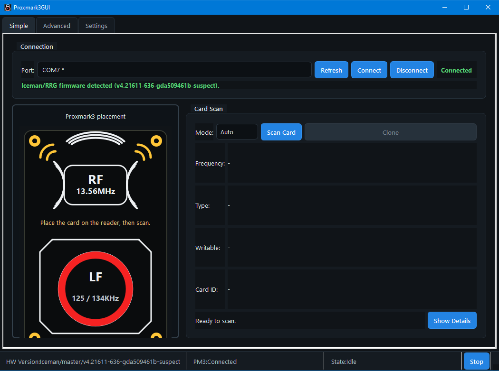
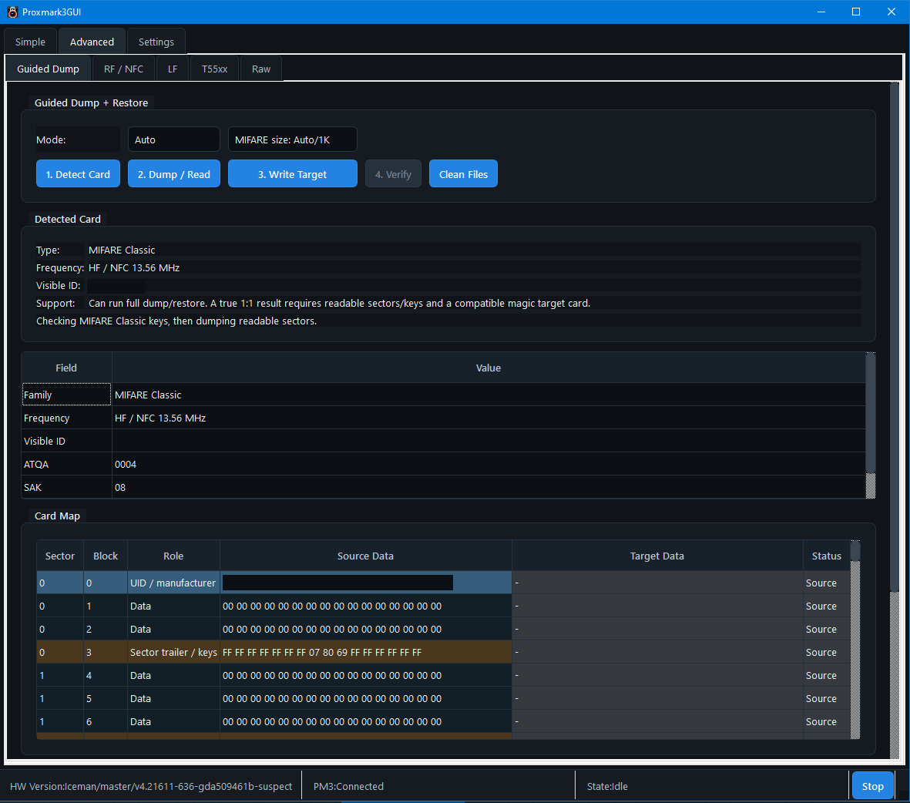

# Proxmark3GUI Modern

Modern Windows-focused GUI for the Proxmark3 RRG/Iceman client.

Project home: [github.com/unicastbg/Proxmark3GUI-Modern](https://github.com/unicastbg/Proxmark3GUI-Modern)

This project is a modernization fork of
[wh201906/Proxmark3GUI](https://github.com/wh201906/Proxmark3GUI). It keeps the
advanced Proxmark workflows while adding a simpler daily-use interface for
connecting, scanning, cloning supported personal tags, and verifying the result.

Use this software only with cards, tags, readers, and systems you own or are
explicitly authorized to test.

## Screenshots

Simple scan and clone workflow:



Guided dump and restore workflow:



## Current Focus

- Windows desktop app built with Qt 6 and MinGW.
- RRG/Iceman Proxmark3 client compatibility.
- Simple page for connection, scan, UID/ID clone, and verification.
- Guided Dump page for MIFARE Classic dump, restore, verify, and visual card map.
- Automatic COM port discovery, including later USB plug-ins.
- Automatic nearby `proxmark3.exe` discovery when possible.
- Clear Proxmark3 LF/HF placement visual.
- Settings cleanup for generated `hf-mf-*` dump/key files.
- Installer support through NSIS.

## What It Can Do Today

- Identify common LF/HF cards through the Proxmark client.
- Clone simple LF EM410x IDs to compatible T5577-style tags.
- Clone visible HF/MIFARE UIDs to compatible magic UID/CUID/USCUID-style cards.
- Dump and restore MIFARE Classic cards when keys are known or discoverable.
- Show a visual MIFARE Classic sector/block map after dump and verify.
- Compare source and target card data where the Proxmark client exposes it.

Full card duplication depends on card family, access keys, locked blocks, target
card type, and reader behavior. The GUI reports failures such as mismatched UID
block 0 or unreadable sectors instead of treating every clone as identical.

## Requirements

- Windows 10/11.
- A Proxmark3-compatible device.
- A matching RRG/Iceman `proxmark3.exe` client.
- Qt 6.11.x and MinGW if building from source.
- NSIS if building the installer.

The app does not currently bundle a Proxmark client in the installer. Put a
known-good RRG/Iceman client near the app or select it in Settings.

## Build From Source

Example local build used during development:

```powershell
$env:PATH='C:\Qt\6.11.2\mingw_64\bin;C:\Qt\Tools\mingw1310_64\bin;' + $env:PATH
mkdir build-modern
cd build-modern
qmake ..\src\Proxmark3GUI.pro
mingw32-make -j4
windeployqt .\release\Proxmark3GUI.exe
```

The built app will be at:

```text
build-modern\release\Proxmark3GUI.exe
```

## Build Installer

Install NSIS, then run:

```powershell
.\installer\nsis\Build-Installer.ps1
```

The script builds the Qt release, stages only runtime files, and creates:

```text
dist\Proxmark3GUI-Modern-0.3.0-setup.exe
```

## GitHub Release Checklist

Before publishing a release:

- Build `Proxmark3GUI.exe`.
- Run `windeployqt`.
- Run the NSIS installer build.
- Test install, launch, connect, scan, clone, dump, and verify.
- Confirm README and release notes mention that users need an RRG/Iceman client.
- Keep upstream attribution and the LGPL-2.1 license.
- Replace screenshots with sanitized release captures if needed.

## Credits

This project is based on the original
[Proxmark3GUI by wh201906](https://github.com/wh201906/Proxmark3GUI).

It is designed for use with the
[RRG/Iceman Proxmark3 client](https://github.com/RfidResearchGroup/proxmark3).

## License

LGPL-2.1, matching the bundled upstream license.
